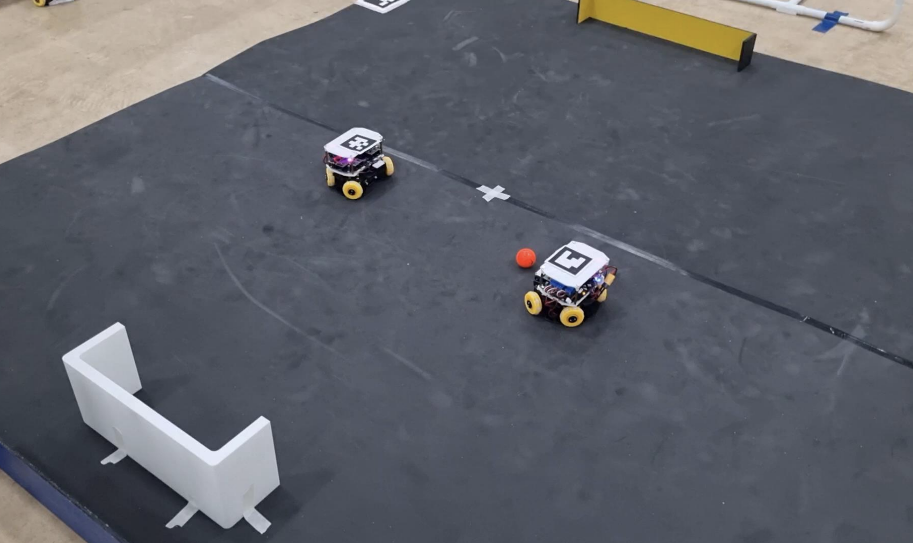
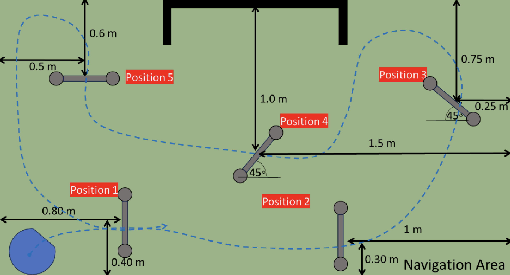

# RCMY Soccer SSL EDU Challenge Hackathon 2025

## Table of contents
- [Challenges](#challenges)
- [Resources](#resources)
- [Schedules](#schedules)
- [Score](#score)

## Challenges
### Challenges 1 : 1-on-1 challenge 

> Robot need to flight with another team's robot, who get more goal will win.

### Challenges 2 : Gate passing challenge

> The robot need to pass the gate without collision. 
>> (5 scores / gate and 10 extra scores when finish loop without collision / round)

[DEMO Video](https://drive.google.com/file/d/1Gv00bJELkF_Lc3sMyPIg2PoESrcOzdB_/view?usp=drive_link)

## Resources

- [STL folder](https://drive.google.com/drive/folders/1-Y4x6I2CYg6UywpXi8ReJrgSJQ3C5y_q?usp=drive_link)
    
    > Files for 3D printing

- [Assembly Guide](https://drive.google.com/file/d/18R8OfuFmEhZX0d3GWcozmI7QvSWfDQi5/view?usp=drive_link)

### Slide
- [Day1 - Slide](https://drive.google.com/file/d/1BWFrK07BFN8VXa02S8ApaI_96yw-tyJA/view?usp=drive_link)
- [Day2 - Slide](https://drive.google.com/file/d/1xAGYtG2EaBW8S_4ZaxSeSavnySFGr-On/view?usp=drive_link)

## Schedules
### 1-on-1 Challenge [Sat 16 AUG 2025]

| Time Slot | Team A Member | Team B Member |
|---|---|---|
| 15:35-15:40 | Member A1 (Muhammad Sukri Bin Baharudin) | Member B1 (Zurin Maisara Binti Rafizul) |
| 15:45-15:50 | Member A2 (Aqil Zafri Bin Khairul Amri) | Member B2 (Nur Farissha Amira Binti Mohamed Faizul) |
| 15:55-16:00 | Member A3 (Nazran Aizat Bin Noranizam) | Member B1 (Zurin Maisara Binti Rafizul) |

### Gate Passing Challenge [Sun 17 AUG 2025]

| Time Slot | Team |
|---|---|
| 09:45 - 09:55 | Team A - Round 1 |
| 10:00 - 10:10 | Team B - Round 1 |
| 10:15 - 10:25 | Team A - Round 2 |
| 10:30 - 10:40 | Team B - Round 2 |
| 10:45 - 10:55 | Team A - Round 3 |
| 11:00 - 11:10 | Team B - Round 3 |

## Member
### Team A

- Muhammad Sukri Bin Baharudin
- Aqil Zafri Bin Khairul Amri
- Nazran Aizat Bin Noranizam

### Team B

- Zurin Maisara Binti Rafizul
- Nur Farissha Amira Binti Mohamed Faizul

## Score

### Challenge 1 : 1-on-1 challenge

| Team | Round 1 | Round 2 | Round 3 | 
|---|---|---|---|
| Team A 🏅 | 5 🏅 | 4 🏅   | 5 🏅   |
| Team B | 0    | 1     | 0     |

### Challenge 2 : Gate Passing Challenge

| Team | Round 1 | Round 2 | Round 3 | 
|---|---|---|---|
| Team A |  |  |  |
| Team B |  |  |  |